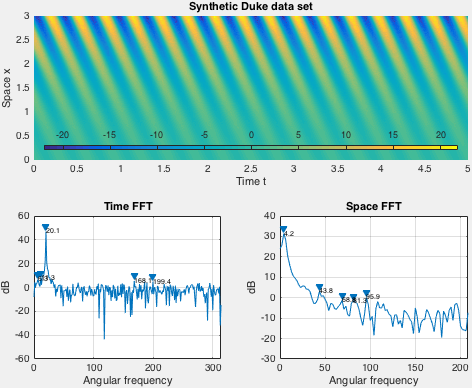

# KOOPMAN MODE DECOMPOSITION #
Matlab toolbox for Koopman mode decomposition.

Written by: Marko Budisic

Koopman mode decomposition is a method for data analysis that identifies fixed shapes (modes) which evolve by exponential growth/decay + oscillation. For a (very) basic overview and comparison with Proper Orthogonal Decomposition, see a [blog post on Marko's website](https://mbudisic.wordpress.com/2015/03/16/two-mode-decompositions-pod-and-dmd/). For a more in-depth overview, please see references [Mezic 2013](#references) and [Budisic et al. 2012](#references) at the bottom of this file.

The goal of this toolbox is to collect several common Koopman mode decomposition algorithms, in a documented, transparent code.

The code is licensed under a BSD3 license, found in the accompanying LICENSE file.


# Installation

Place the toolbox on the drive, e.g., to ~/MatlabToolbox/koopman, and add its top folder to Matlab path.

    >>> addpath("~/MatlabToolbox/koopman")
    >>> savepath

Then functions from the toolbox can be accessed via namespace "koopman". Executing

    >> doc koopman

should list the contents of the toolbox.

# Use

## Basic syntax

Currently, the toolbox implements three algorithms based on Dynamic Mode Decomposition:

* DMD by [Tu et al. 2014](#References) which uses SVD decomposition of input snapshots,
* DMD by [Duke et al. 2012](#References) which uses QR decomposition of input snapshots,
* DMD by [Chen et al. 2012](#References) which uses SVD decomposition of the square of input snapshots, and
* direct Koopman mode decomposition based on Discrete Fourier Transform (FFT) of input data.

All functions have a similar syntax. Let's suppose that a ```Snapshots``` matrix holds a multidimensional data sampled from a process, with each column corresponding to a snapshot at a single time instance, and snapshots taken at a time resolution of ```dt```.

To compute Koopman modes using the provided algorithms, run either:

    >> [Spectrum, Modes, Amplitudes] = koopman.DMD( Snapshots, dt )
    >> [Spectrum, Modes, Amplitudes] = koopman.DMD_Duke( Snapshots, dt )
    >> [Spectrum, Modes, Amplitudes] = koopman.DMD_Snapshot( Snapshots, dt )
    >> [Spectrum, Modes, Amplitudes] = koopman.KDFT( Snapshots, dt )

Output variables are

* ```Spectrum```, a vector of complex frequencies, where positive real parts indicate growing modes, negative decaying modes, and imaginary parts give oscillation frequencies
* ```Modes```, matrix of spatial shapes, where complex-valued column corresponds to an element of ```Spectrum```,
* ```Amplitudes```, a vector of complex amplitudes that minimize the L2 distance between the input data, and the reconstruction, due to [Jovanovic et al. 2014](#references)

For further documentation, see help lines for individual functions in the koopman namespace.

## Demonstration script

A demo (and validation) for the toolbox is located in koopman/validate folder. Once the namespace +koopman is in the path, demo can be run by

    >> cd [toolboxfolder]/validate
    >> DemoKoopmanModes

Demo implements an exponentially growing mode used by Duke et al. Spatial shape of the data set is fixed in demo, while the time behavior is set via arguments to the demo function.

### Duke data with decay rate -0.1 and angular frequency 21:

#### Input visualization


#### Output


### Duke data with no decay and angular frequency 20:

#### Input visualization



#### Output


# References

* [Budišić, Marko, Ryan M. Mohr, and Igor Mezić. 2012. “Applied Koopmanism.” Chaos: An Interdisciplinary Journal of Nonlinear Science 22 (4)](http://dx.doi.org/10.1063/1.4772195)
* [Chen, Kevin K., Jonathan H. Tu, and Clarence W. Rowley. 2012. “Variants of Dynamic Mode Decomposition: Boundary Condition, Koopman, and Fourier Analyses.” Journal of Nonlinear Science 22 (6)](http://dx.doi.org/10.1007/s00332-012-9130-9)
* [Duke, Daniel, Julio Soria, and Damon Honnery. 2012. An Error Analysis of the Dynamic Mode Decomposition. Experiments in Fluids 52 (2): 529–42.](http://dx.doi.org/10.1007/s00348-011-1235-7)
* [Jovanović, Mihailo R., Peter J. Schmid, and Joseph W. Nichols. 2014. Sparsity-Promoting Dynamic Mode Decomposition. Physics of Fluids 26 (2)](http://dx.doi.org/10.1063/1.4863670)
* [Mezić, Igor. 2013. Analysis of Fluid Flows via Spectral Properties of the Koopman Operator. Annual Review of Fluid Mechanics 45 (1): 357–78.](http://dx.doi.org/10.1146/annurev-fluid-011212-140652)
* [Tu, Jonathan H., Clarence W. Rowley, Dirk M. Luchtenburg, Steven L. Brunton, and J. Nathan Kutz. 2013. On Dynamic Mode Decomposition: Theory and Applications. Journal of Computational Dynamics.](http://dx.doi.org/10.3934/jcd.2014.1.391)
